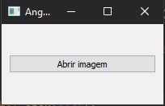
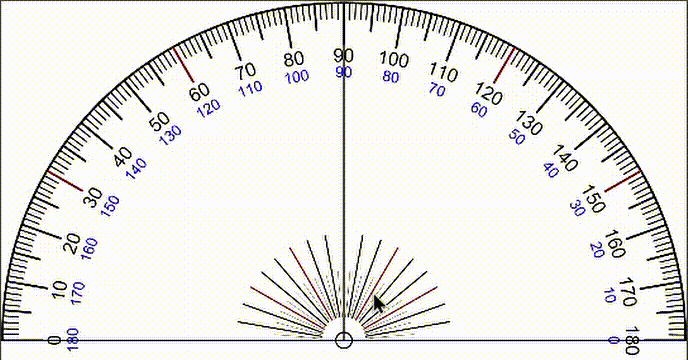
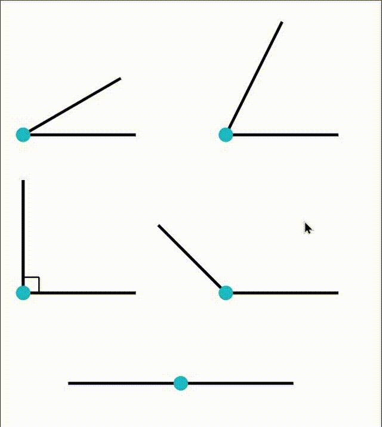

# Angle Finder

Depois de selecionar três pontos em uma imagem é calculado o ângulo.

## Instalação

Use o gerenciador de pacotes [pip](https://pip.pypa.io/en/stable/) para instalar os requisitos.

```bash
pip install requirements.txt
```

## Execução

Foi feito um interface grafica simples para ajudar na seleção das imagens.

```bash
python GUI.py
```



## Exemplo

No exemplo 1 temos um gif usando uma imagem do transferidor para validação do projeto.



No exemplo 2 tem uma demostração de como pode ser usada.


